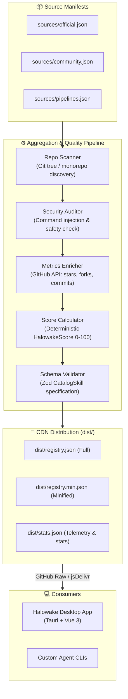

# 🌐 Halowake Skills Registry

> **Centralized, Verified & Automated Skills Registry Pipeline for the Halowake AI Coding Assistant.**

[](https://github.com/zhkai-ybwn/halowake-skills-registry/actions/workflows/update-registry.yml)
[](LICENSE)

---

## 🎯 Purpose & Philosophy

In modern agentic AI development, developers shouldn't have to manually hunt for `SKILL.md` configurations across hundreds of GitHub repositories. **Halowake Skills Registry** serves as the automated registry and packaging backbone for **Halowake**:

- **Zero-Cognitive Load**: Halowake desktop users discover, search, and 1-click install skills directly from an authentic, pre-curated store.
- **Authentic Metrics (No Fabricated Stars)**: Every star, fork, and recency metric is queried live from GitHub API. Scores are determined transparently by an algorithmic formula.
- **Static & Serverless Distribution**: Compiled into standard JSON (`dist/registry.json`) and distributed globally via GitHub Raw CDN and jsDelivr with zero hosting costs.
- **Automated Freshness**: GitHub Actions cron jobs continuously pull upstream changes, verify security compliance, and rebuild the registry every 6 hours.

---

## 🏛 Architecture



---

## 📁 Repository Structure & Modularity

All single files in `src/` adhere to strict modularity guidelines (targeted under **250 lines per file**) for maintainability:

```text
halowake-skills-registry/
├── .github/workflows/
│   ├── update-registry.yml    # Cron pipeline (runs every 6h + push to main)
│   └── validate-pr.yml        # Validates community PR submissions
├── sources/
│   ├── official.json          # Curated upstream repositories (Anthropic, Superpowers, etc.)
│   ├── community.json         # Community-contributed skills and tools
│   └── pipelines.json         # Curated multi-agent SDLC workflows
├── src/
│   ├── builder/
│   │   ├── dist-writer.ts     # Serializes JSON and generates statistics
│   │   └── registry-builder.ts# Core pipeline coordinator
│   ├── collector/
│   │   ├── frontmatter-parser.ts # SKILL.md YAML/Markdown parser
│   │   ├── github-client.ts   # GitHub API wrapper with rate-limit handling
│   │   └── repo-scanner.ts    # Monorepo and standalone repository scanner
│   ├── enricher/
│   │   ├── category-classifier.ts # SDLC stage & category classification
│   │   ├── metrics-enricher.ts # Authentic GitHub stars/forks/commits fetcher
│   │   └── score-calculator.ts# Transparent 0-100 algorithmic score engine
│   ├── validator/
│   │   ├── schema-validator.ts # Zod schema enforcement
│   │   └── security-auditor.ts# Static security & prompt safety checks
│   ├── cli.ts                 # CLI entry point
│   ├── index.ts               # Programmatic SDK exports
│   └── types/                 # TypeScript interfaces
├── test/                      # Vitest unit test suite
├── dist/                      # Production distribution files (committed for Raw CDN)
└── package.json
```

---

## 🧮 Score & Badge Algorithm

Each skill receives an algorithmic `halowakeScore` (0–100):

| Component | Max Points | Description |
| :--- | :--- | :--- |
| **Base Quality** | 40 | Baseline verification score |
| **Authentic Stars** | 30 | Logarithmic scaling: $\min(30, \lfloor\log_{10}(\text{stars} + 1) \times 7.5\rfloor)$ |
| **Freshness** | 15 | Up to 15 pts for commits within 14 days, decreasing for older repos |
| **Issue Health** | 10 | Proportion of resolved issues |
| **Documentation & Safety** | 5 | Security audit pass & structured documentation |

Badges are assigned systematically:
- 🛡️ **`verified`**: Maintained by verified/official organizations.
- 🔥 **`trending`**: High star velocity ($\ge 500$ stars) and active updates within 60 days.
- 🔒 **`security`**: Clean security audit and issue close rate $\ge 85\%$.
- 👥 **`community`**: Open community contributions.

---

## 🔗 Endpoint URLs for Halowake

Halowake connects to this registry via:

- **Primary URL**:
  `https://raw.githubusercontent.com/zhkai-ybwn/halowake-skills-registry/main/dist/registry.json`
- **Fast CDN (jsDelivr)**:
  `https://cdn.jsdelivr.net/gh/zhkai-ybwn/halowake-skills-registry@main/dist/registry.json`

---

## 🛠 Local Development

```bash
# 1. Install dependencies
npm install

# 2. Run unit tests
npm test

# 3. Dry-run pipeline without writing files
npm run registry:dry-run

# 4. Build production registry
npm run registry:build
```

---

## 🤝 Submitting a Community Skill

1. Fork this repository.
2. Add your repository details to `sources/community.json`.
3. Run `npm test` and `npm run registry:dry-run` to verify that your skill passes security audit and schema validation.
4. Open a Pull Request! The automated workflow will validate your submission.
