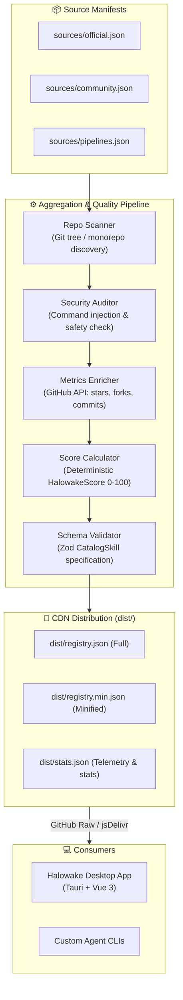

# 🌐 Halowake Skills Registry

> GitHub-hosted directory of curated skills and community skill pointers for Lumina.

[](https://github.com/zhkai-ybwn/halowake-skills-registry/actions/workflows/update-registry.yml)
[](LICENSE)

---

## 🎯 Purpose & Philosophy

In modern agentic AI development, developers shouldn't have to manually hunt for `SKILL.md` configurations across hundreds of GitHub repositories. **Halowake Skills Registry** serves as the automated registry and packaging backbone for **Halowake**:

- **Installable paths**: Every entry points to an upstream GitHub repository and optional skill directory. The desktop app checks for `SKILL.md` before completing installation.
- **Separate trust levels**: Curated skills are scanned and enriched with GitHub data. Imported community metadata is labelled `community`, with no security audit or quality score claimed.
- **Static & Serverless Distribution**: Compiled into standard JSON (`dist/registry.json`) and distributed globally via GitHub Raw CDN and jsDelivr with zero hosting costs.
- **Incremental discovery**: GitHub Actions rotates search pages every 6 hours and retains previously published entries when a source is temporarily unavailable.
- **Readable usage summaries**: The collector extracts a short summary, trigger conditions, steps, and a brief example from each skill's own `SKILL.md`. The extracted fields and source link are persisted in the published registry.

---

## 🏛 Architecture


```mermaid
flowchart TD
    subgraph Sources ["📦 Source Manifests"]
        S1["sources/official.json"]
        S2["sources/community.json"]
        S3["sources/pipelines.json"]
    end

    subgraph Pipeline ["⚙️ Aggregation & Quality Pipeline"]
        direction TB
        RS["Repo Scanner<br/>(Git tree / monorepo discovery)"]
        SA["Security Auditor<br/>(Command injection & safety check)"]
        ME["Metrics Enricher<br/>(GitHub API: stars, forks, commits)"]
        SC["Score Calculator<br/>(Deterministic HalowakeScore 0-100)"]
        SV["Schema Validator<br/>(Zod CatalogSkill specification)"]
    end

    subgraph Distribution ["🚀 CDN Distribution (dist/)"]
        D1["dist/registry.json (Full)"]
        D2["dist/registry.min.json (Minified)"]
        D3["dist/stats.json (Telemetry & stats)"]
    end

    subgraph Consumers ["💻 Consumers"]
        HW["Halowake Desktop App<br/>(Tauri + Vue 3)"]
        CLI["Custom Agent CLIs"]
    end

    Sources --> RS
    RS --> SA
    SA --> ME
    ME --> SC
    SC --> SV
    SV --> Distribution
    Distribution -->|GitHub Raw / jsDelivr| Consumers
```

---

## 📁 Repository Structure & Modularity

All single files in `src/` adhere to strict modularity guidelines (targeted under **250 lines per file**) for maintainability:

```text
halowake-skills-registry/
├── .github/workflows/
│   ├── update-registry.yml    # Cron pipeline (runs every 6h + push to main)
│   └── validate-pr.yml        # Validates community PR submissions
├── sources/
│   ├── official.json          # Curated upstream repositories (Anthropic, Superpowers, etc.)
│   ├── community.json         # Community-contributed skills and tools
│   └── pipelines.json         # Curated multi-agent SDLC workflows
├── src/
│   ├── builder/
│   │   ├── dist-writer.ts     # Serializes JSON and generates statistics
│   │   └── registry-builder.ts# Core pipeline coordinator
│   ├── collector/
│   │   ├── frontmatter-parser.ts # SKILL.md YAML/Markdown parser
│   │   ├── github-client.ts   # GitHub API wrapper with rate-limit handling
│   │   └── repo-scanner.ts    # Monorepo and standalone repository scanner
│   ├── enricher/
│   │   ├── category-classifier.ts # SDLC stage & category classification
│   │   ├── metrics-enricher.ts # Authentic GitHub stars/forks/commits fetcher
│   │   └── score-calculator.ts# Transparent 0-100 algorithmic score engine
│   ├── validator/
│   │   ├── schema-validator.ts # Zod schema enforcement
│   │   └── security-auditor.ts# Static security & prompt safety checks
│   ├── cli.ts                 # CLI entry point
│   ├── index.ts               # Programmatic SDK exports
│   └── types/                 # TypeScript interfaces
├── test/                      # Vitest unit test suite
├── dist/                      # Production distribution files (committed for Raw CDN)
└── package.json
```

---

## 🧮 Score & Badge Algorithm

Each skill receives an algorithmic `halowakeScore` (0–100):

| Component | Max Points | Description |
| :--- | :--- | :--- |
| **Base Quality** | 40 | Baseline verification score |
| **Authentic Stars** | 30 | Logarithmic scaling: $\min(30, \lfloor\log_{10}(\text{stars} + 1) \times 7.5\rfloor)$ |
| **Freshness** | 15 | Up to 15 pts for commits within 14 days, decreasing for older repos |
| **Issue Health** | 10 | Proportion of resolved issues |
| **Documentation & Safety** | 5 | Security audit pass & structured documentation |

Badges are assigned systematically:
- 🛡️ **`verified`**: Maintained by verified/official organizations.
- 🔥 **`trending`**: High star velocity ($\ge 500$ stars) and active updates within 60 days.
- 🔒 **`security`**: Clean security audit and issue close rate $\ge 85\%$.
- 👥 **`community`**: Open community contributions.

---

## 🔗 Endpoint URLs for Halowake

Halowake connects to this registry via:

- **Primary URL**:
  `https://raw.githubusercontent.com/zhkai-ybwn/halowake-skills-registry/main/dist/registry.min.json`
- **Fast CDN (jsDelivr)**:
  `https://cdn.jsdelivr.net/gh/zhkai-ybwn/halowake-skills-registry@main/dist/registry.min.json`

---

## 🛠 Local Development

On the first build, the registry imports up to 2,000 GitHub skill pointers from the [Agent Skills Corpus](https://github.com/lawrence3699/agent-skills-corpus). Its metadata is CC0; underlying skill files keep their upstream licenses and are not copied into this repository. The corpus is a dated snapshot, so a listed path may later disappear. The app checks the original repository when installing.

Each run also scans curated `sources/*.json` entries and a bounded set of newly discovered or previously discovered GitHub repositories. `dist/collector-state.json` stores the search page and refresh state. `dist/registry.json` preserves the previous catalog when an upstream request fails. Community entries are source pointers, not verified recommendations.

The `usageGuide` field is extracted from upstream `SKILL.md` text, without executing it or generating new instructions. It stores a source URL and SHA-256 hash so users can check the original. Curated skills are summarized during scanning; community pointers are enriched in batches of up to 200 per run. Failed downloads are retried after 24 hours, and existing guides are checked again after 30 days. Set `REGISTRY_GUIDE_BATCH=0` to skip enrichment in a local build or lower it to reduce network traffic. Some records will have no guide when their source file is missing or unavailable.

The default discovery cap is 20 new repositories per run, plus 5 refreshes. Set `REGISTRY_MAX_REPOSITORIES` to tune it. Authenticated builds should provide `GITHUB_TOKEN`. A large drop in published entries fails the build; use `REGISTRY_ALLOW_SHRINK=1` only for an intentional reset. Use `--refresh-corpus` to reimport the snapshot manually.

GitHub search is a candidate source, not an exhaustive index of the web. The current collector covers public GitHub repositories with discoverable `SKILL.md` files. Other registries and hosting providers require separate adapters.

```bash
# 1. Install dependencies
npm install

# 2. Run unit tests
npm test

# 3. Dry-run pipeline without writing files
npm run registry:dry-run

# 4. Build production registry
npm run registry:build
```

---

## 🤝 Submitting a Community Skill

1. Fork this repository.
2. Add your repository details to `sources/community.json`.
3. Run `npm test` and `npm run registry:dry-run` to verify that your skill passes security audit and schema validation.
4. Open a Pull Request! The automated workflow will validate your submission.
